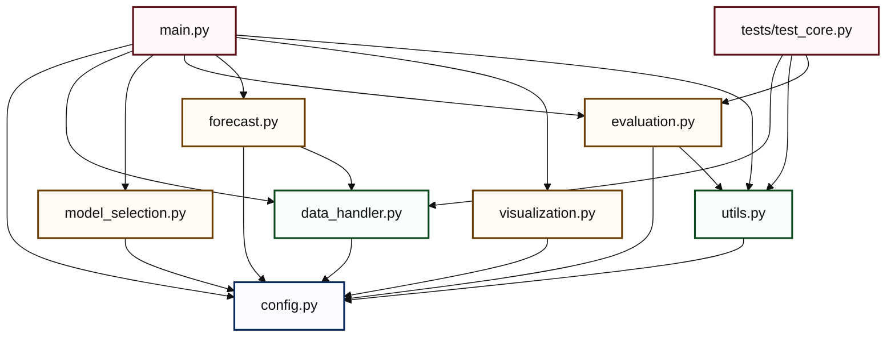
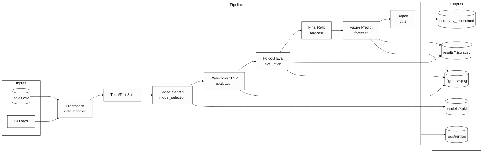
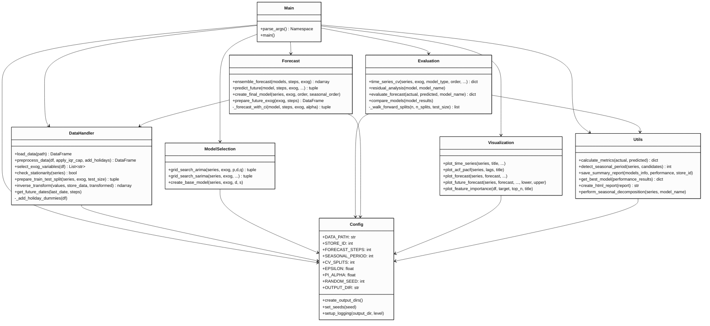
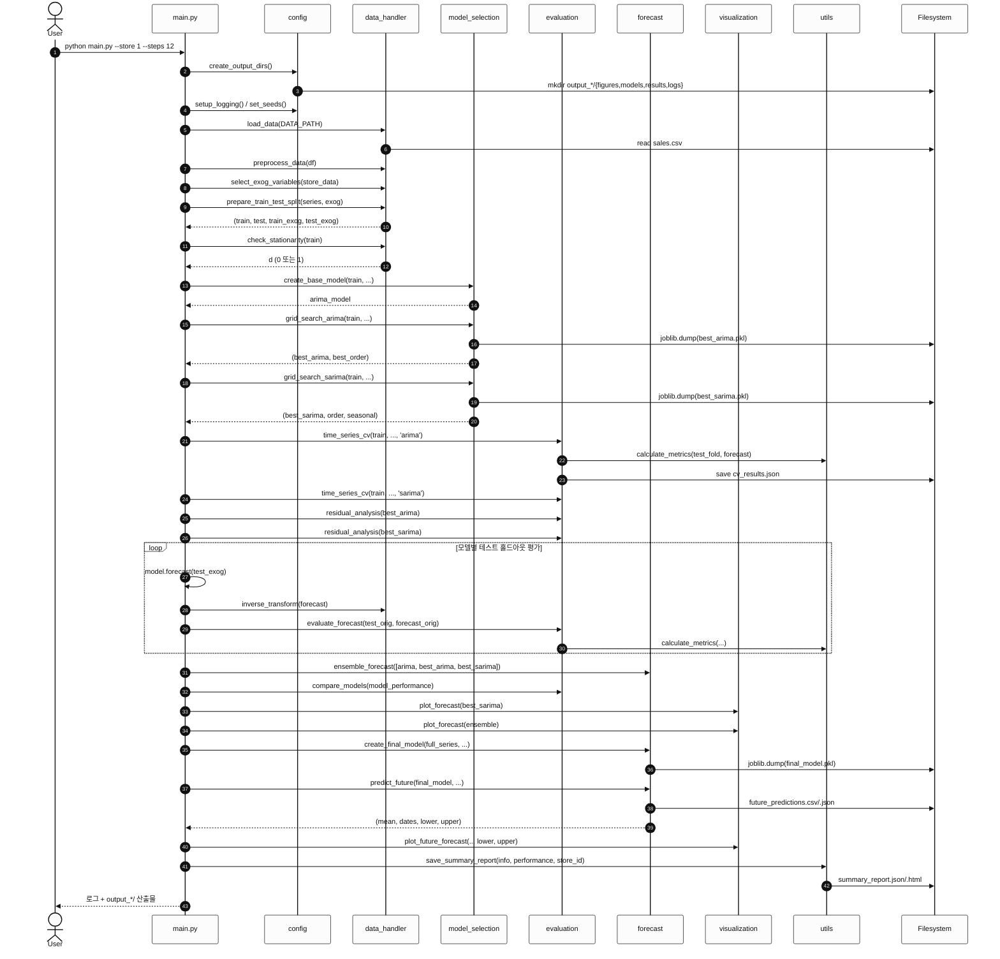
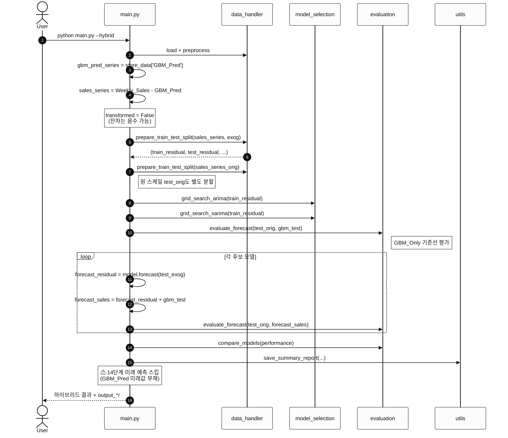
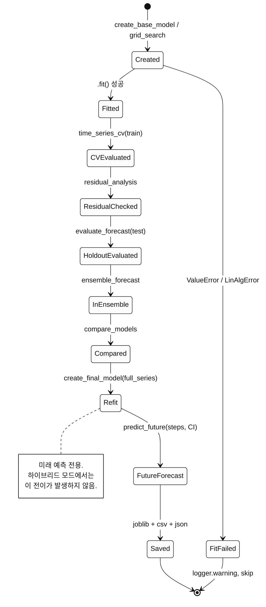
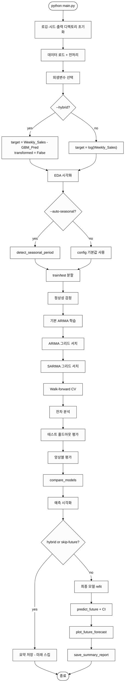
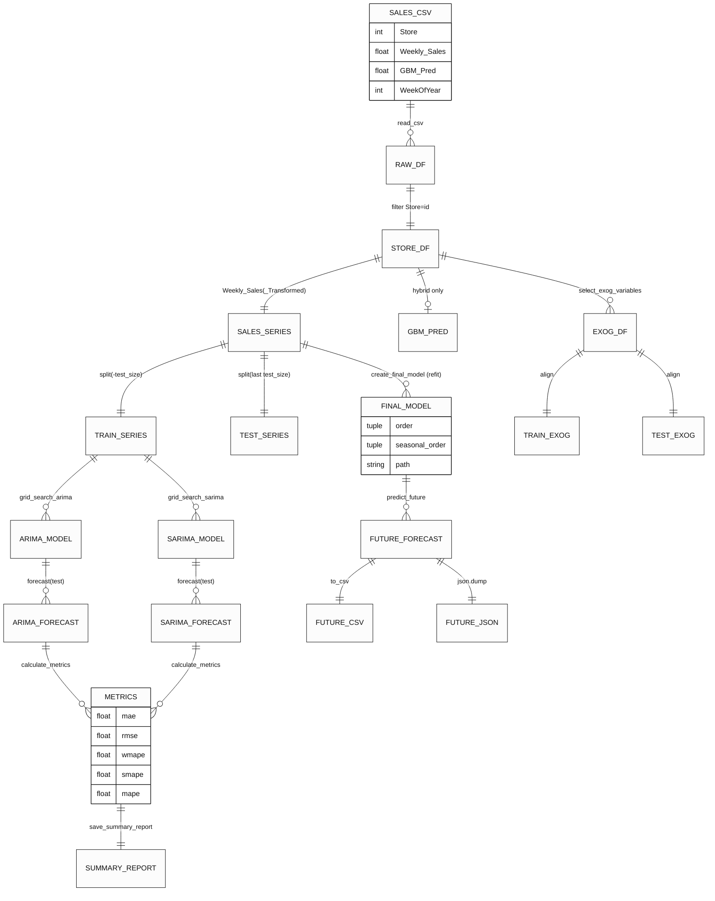

# UML 다이어그램

본 문서는 `forecasting_arima` 파이프라인의 구조와 동작을 **Mermaid** 문법의
UML 다이어그램으로 정리합니다. GitHub, JetBrains IDE, VS Code의 Markdown
프리뷰에서 바로 렌더링됩니다.

포함된 다이어그램:

1. [모듈 의존성 그래프](#1-모듈-의존성-그래프)
2. [컴포넌트 다이어그램](#2-컴포넌트-다이어그램)
3. [주요 함수 클래스 뷰](#3-주요-함수-클래스-뷰)
4. [전체 실행 시퀀스](#4-전체-실행-시퀀스)
5. [하이브리드 모드 시퀀스](#5-하이브리드-모드-시퀀스)
6. [모델 학습·평가 상태 다이어그램](#6-모델-학습평가-상태-다이어그램)
7. [CLI 실행 활동 다이어그램](#7-cli-실행-활동-다이어그램)
8. [데이터 플로우](#8-데이터-플로우)

---

## 1. 모듈 의존성 그래프

모듈 간 import 관계 (↓ 하위 레이어로만 단방향).

---

## 2. 컴포넌트 다이어그램

파이프라인의 실행 컴포넌트와 산출물.

---

## 3. 주요 함수 클래스 뷰

모듈을 "의사 클래스(pseudo class)"로 표현. 실제 Python 코드는 함수형이지만,
각 모듈이 하나의 네임스페이스로서 기능한다는 시각화입니다.

---

## 4. 전체 실행 시퀀스

표준 모드(`python main.py`)의 런타임 상호작용.

---

## 5. 하이브리드 모드 시퀀스

`--hybrid` 플래그가 있을 때의 분기 흐름. target을 `Weekly_Sales − GBM_Pred`로
재정의하고, 평가 시 `GBM_Pred`를 다시 더한 뒤, 미래 예측 단계는 건너뜁니다.

---

## 6. 모델 학습·평가 상태 다이어그램

단일 모델이 파이프라인 내에서 거치는 상태 전이.

---

## 7. CLI 실행 활동 다이어그램

`main.main()`의 분기 포함 활동 흐름.

---

## 8. 데이터 플로우

시리즈·모델·아티팩트의 흐름을 ER 스타일로.

---

## 렌더링 팁

- **GitHub**: `.md` 파일을 커밋하면 자동으로 Mermaid 블록이 렌더링됩니다.
- **PyCharm / IntelliJ**: Markdown 플러그인이 Mermaid를 기본 지원합니다. 프리뷰
  창(`Ctrl+Shift+A` → "Markdown Preview")에서 확인.
- **VS Code**: `Markdown Preview Mermaid Support` 확장 설치.
- **정적 HTML**: `mmdc -i docs/uml.md -o docs/uml.html` (mermaid-cli).
